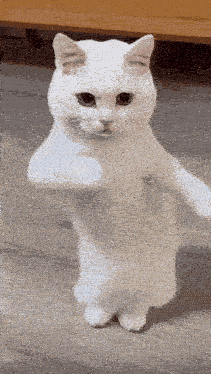

# Học lại HTML từ đầu
### Tại sao vậy ???
<table>
    <tr>
        <td>Tại ngày xưa lười nên há»c chẳng hiểu gì,  bây giá» mình muốn bắt đầu lại từ đầu mua hehe</td>
        <td>
            
        </td>
    </tr>

</table>

### Những thứ sẽ học
- Cấu trúc File HTML
- Tác dụng của các thẻ tag
- Các thuộc tính của thẻ
- Xây dựng một trang html cơ bản 
 

---

### Cảm nhận của mình về `MTikCode`

<table>
<tr>
  <td>

- Mình là người bị dính vào Tutorial Hell 😩  
  Nhưng kể từ khi biết đến youtuber này, mọi thứ đã thay đổi...  
  *(Tin mình đi mình đã lướt và xem hàng chục video YouTube về HTML đến gãy tay)*

- Kỹ năng sư phạm tốt và giọng nói cute  
- Nội dung được thiết kế rất dễ hiểu và kèm ví dụ thực tế

  </td>
  <td>
    
  </td>
</tr>
</table>

---

### Link Kênh Youtube Kênh MTikCode Ở Bên Dưới Nhé ↓↓↓↓

[Link Tới Kênh Youtube](https://www.youtube.com/@MTikCode)

